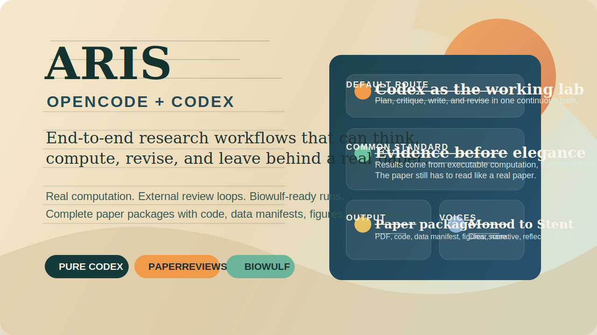
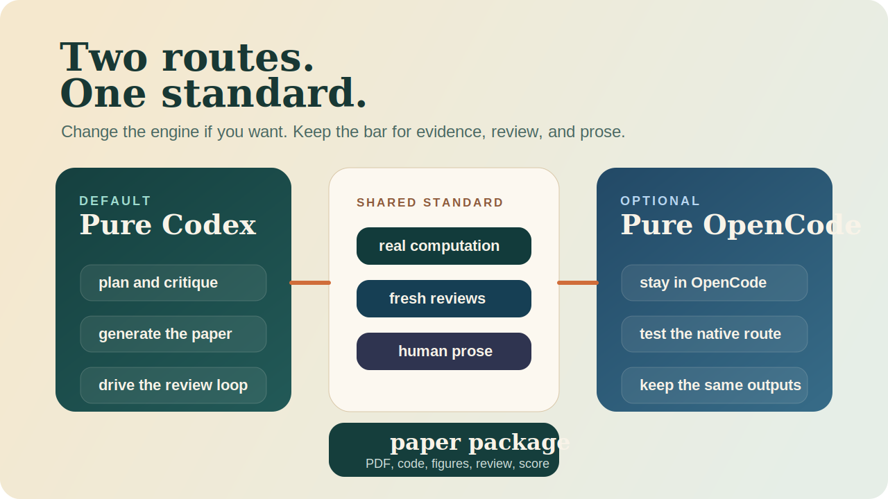
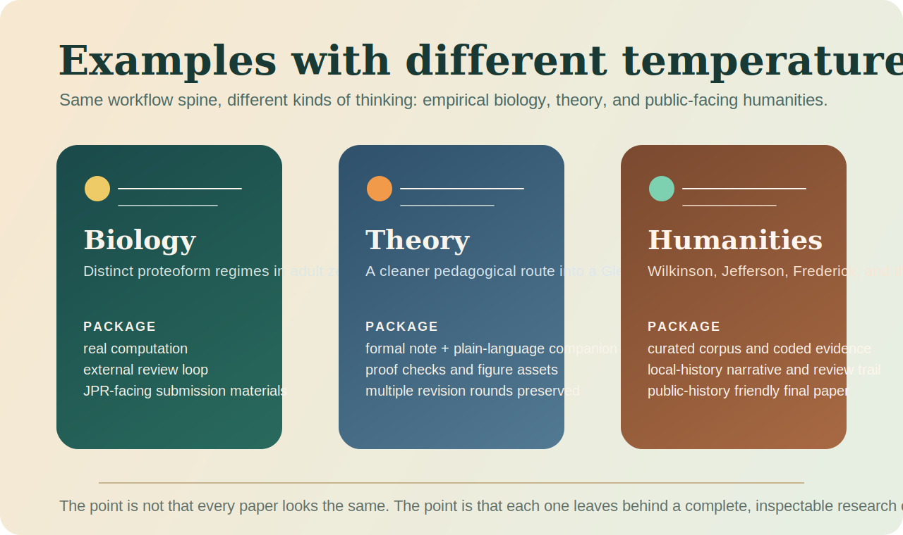

# ARIS for OpenCode and Codex

OpenCode-native port of [wanshuiyin/Auto-claude-code-research-in-sleep](https://github.com/wanshuiyin/Auto-claude-code-research-in-sleep) at upstream commit `e8ab30fdd01cfce03bd1695de9943f629849b792`.

## Attribution

This repository is a derivative packaging of the original ARIS work by the upstream authors at `wanshuiyin/Auto-claude-code-research-in-sleep`.

- Original project: [wanshuiyin/Auto-claude-code-research-in-sleep](https://github.com/wanshuiyin/Auto-claude-code-research-in-sleep)
- Upstream snapshot used here: `e8ab30fdd01cfce03bd1695de9943f629849b792`
- Original license: MIT, preserved in [LICENSE](LICENSE)
- Port-specific changes in this repo: OpenCode command wrappers, OpenCode config scaffolding, repo-level `AGENTS.md`, and compatibility edits for OpenCode paths

See [NOTICE.md](NOTICE.md) and [UPSTREAM.md](UPSTREAM.md) for the exact provenance.

This repo keeps the upstream research skills, ports the few Claude-specific file paths that would break in OpenCode, and adds route-aware workflow commands in `.opencode/commands/`.

## What is included

- `.opencode/skills/` — 18 upstream research skills copied from ARIS
- `.opencode/commands/` — OpenCode command wrappers, including explicit OpenCode and Codex route variants for the top-level workflows
- port-native additions — `paper-upgrade` for linked-paper improvement, `biowulf-gpu` for one-node Biowulf GPU allocation, module setup, and scratch-disk staging, and `classic-biology-prose` for natural paper writing
- `AGENTS.md` — repo-level instructions for using the port in OpenCode
- `opencode.jsonc` — sample OpenCode-native model and optional MCP configuration
- `templates/project-AGENTS.md` — project metadata template for GPU servers, paper libraries, and paper defaults
- `WORKFLOW_ROUTES.md` — route map for pure Codex versus pure OpenCode execution
- `UPSTREAM.md` — upstream source snapshot and provenance reference

## Workflow Routes

This repo now supports two explicit execution routes:

- **Pure Codex** — default from this point forward
- **Pure OpenCode** — opt-in when you explicitly want the OpenCode-native path

Read [WORKFLOW_ROUTES.md](WORKFLOW_ROUTES.md) for the exact command surface.

## Quick Start

1. Decide your route:
   - default: **Pure Codex**
   - optional: **Pure OpenCode**
2. If you want the pure OpenCode route, open this folder in OpenCode and review [opencode.jsonc](opencode.jsonc). Optional `zotero` and `obsidian-vault` entries remain disabled until you configure them.
3. If you want GPU execution or local paper-library lookup in another repo, copy [templates/project-AGENTS.md](templates/project-AGENTS.md) into that project as `AGENTS.md` and fill in the relevant sections.
4. Run one of these top-level workflows:
   - Codex direct: `Run the Codex research pipeline for: test-time adaptation for robotics`
   - OpenCode generic command, still routed to Codex by default: `/research-pipeline test-time adaptation for robotics`
   - OpenCode explicit: `/research-pipeline-opencode test-time adaptation for robotics`
   - Codex explicit: `/research-pipeline-codex test-time adaptation for robotics`
   - Codex direct paper route: `Run the Codex paper-writing workflow for: NARRATIVE_REPORT.md`
   - OpenCode generic paper command, still routed to Codex by default: `/paper-writing NARRATIVE_REPORT.md`
   - OpenCode explicit paper route: `/paper-writing-opencode NARRATIVE_REPORT.md`
   - OpenCode generic paper-upgrade command, still routed to Codex by default: `/paper-upgrade "https://arxiv.org/abs/2401.12345 — this is my paper"`
5. For the shortest setup path, read [QUICKSTART.md](QUICKSTART.md).
6. For the narrative walkthrough, read [AUTO_RESEARCH_GUIDE.md](AUTO_RESEARCH_GUIDE.md).

## Writing Style Default

Paper prose in this repo now defaults to [classic-biology-prose](.opencode/skills/classic-biology-prose/SKILL.md).

That means the writing workflow aims for:

- the clarity of Monod and Crick
- the narrative movement of Jacob
- the personality of Brenner
- the reflective cadence of Stent

In practice, the paper should open with the scientific or historical question, state the central point early, avoid machine-sounding workflow prose, and end with a closing paragraph that feels reflective rather than canned.

Just as important, the default is **not** project-report prose. Papers in this repo should not read like build logs, revision memos, homework notes, or annotated workflow transcripts. They should read like authoritative papers written by serious researchers.

If a venue or project needs a different voice, you can still override it explicitly in the prompt or in the target project's `AGENTS.md`.

## External Paper Review Backend

Paper-improvement loops now prefer [paperreview.ai](https://paperreview.ai/) when it is configured.

- Set `PAPERREVIEW_EMAIL` or add a project `AGENTS.md` `## External Review` section with the submission email.
- The workflow saves the returned token locally and polls the review endpoint, so it does not depend on email delivery to continue.
- The email is part of submission and optional notification. After submission, the saved token is enough to retrieve the review.
- Current service limits: English PDFs only, max `10MB`, first `15` pages analyzed.
- The site currently exposes its calibrated numeric score only for `ICLR`.
- If the service is unavailable or unsuitable for the paper, the workflow falls back to the route-local reviewer and records that fallback in local artifacts.

## Complete Final Paper Standard

In this repo, a paper is only considered a complete final paper package when it includes:

- reported results generated by real executable computation
- the finished paper PDF and source
- the round-by-round paper-improvement history driven by fresh reviewer passes
- all code used to build or support the paper
- sample data, or an explicit local manifest linking the source data and literature inputs
- a dedicated folder of high-resolution figure assets
- a detailed review opinion
- a score

The compiled PDF is necessary, but it is not sufficient on its own. If the work is too large for local compute, use Biowulf for the serious experimental runs and package the resulting code, artifacts, and provenance locally with the paper.

The prose standard matters too. A final paper in this repo should read like a serious human paper, not like a system report that happens to compile.

## Sample Example

If you want to see a concrete sample artifact set before running anything yourself, start with [examples/end-to-end-sample/README.md](examples/end-to-end-sample/README.md).
The intended one-command end state of `/research-pipeline` is now: `IDEA_REPORT.md` + `AUTO_REVIEW.md` + `NARRATIVE_REPORT.md` + `paper/main.pdf` + `paper/PAPER_IMPROVEMENT_LOG.md` + `review/REVIEW_OPINION.md` + `review/review_scorecard.json`.
If you want a tracked sample that ends in a complete paper package, read [examples/full-paper-sample/README.md](examples/full-paper-sample/README.md).
If you want the linked-paper upgrade workflow shape, read [examples/paper-upgrade-sample/README.md](examples/paper-upgrade-sample/README.md).

## Porting Notes

- Upstream `CLAUDE.md` references were changed to `AGENTS.md`.
- Upstream `~/.claude/feishu.json` references were changed to `~/.config/opencode/feishu.json`.
- The original upstream workflow used a separate reviewer path. In this repo, the generic default route is now Codex, while a pure OpenCode route remains available by explicit choice.
- The upstream repo did not ship actual command files. The command wrappers here are new and map one-to-one to the upstream workflow/skill names.

## Recommended MCP Setup

The pure OpenCode route does not require any reviewer MCP server. Optional integrations:

- `zotero` — literature search over a Zotero library
- `obsidian-vault` — note search over an Obsidian vault

`zotero` and `obsidian-vault` remain scaffolded but disabled by default.

For the broader story of what we learned while getting this project into reliable shape, read [docs/technical/project-setup-stories.md](docs/technical/project-setup-stories.md).

## Community

- [CONTRIBUTING.md](CONTRIBUTING.md) — contribution expectations for docs, skills, and workflow changes
- [SUPPORT.md](SUPPORT.md) — how to ask for help effectively
- [SECURITY.md](SECURITY.md) — how to report security-sensitive issues
- GitHub issue templates and the PR template live under `.github/`

## Upstream

Source repo: [wanshuiyin/Auto-claude-code-research-in-sleep](https://github.com/wanshuiyin/Auto-claude-code-research-in-sleep)

Reference snapshot: [UPSTREAM.md](UPSTREAM.md)
