# Algorithm Guide for Biologists

This document explains the main algorithms and model families that appear in this ARIS repository. It is written for biologists and other domain scientists who want to understand what the computation is doing without first learning computer science.

The project contains two kinds of methods:

- **Methods used directly in the local examples**: statistics, overlap measures, resampling, detectability checks, text coding, network summaries, simulation, scheduling, and review-revision loops.
- **AI and machine-learning model families used by, discussed by, or likely to appear in ARIS workflows**: Transformer, GPT-style language models, BERT-style language models, CNNs, XGBoost, random forests, SVMs, and related models.

The recurring biological idea is simple: an algorithm is a disciplined way of turning observations into a comparison, a prediction, a ranking, or a decision.

## Quick Map

| Algorithm or method | Plain-language role | Used directly here? |
| --- | --- | --- |
| Tokenization and canonicalization | Clean names or text so like can be compared with like | Yes |
| Jaccard overlap | Measures how much two sets share | Yes |
| Weighted Jaccard and Bray-Curtis | Measures abundance-aware similarity | Yes |
| Wilson interval | Gives a stable uncertainty interval for a proportion | Yes |
| Odds ratio | Compares enrichment between two groups | Yes |
| Fisher exact and hypergeometric tests | Tests whether overlap or enrichment is surprising | Yes |
| Logistic regression | Models a yes/no outcome from several predictors | Yes |
| Bootstrap | Repeats analysis on resampled data to estimate stability | Yes |
| Permutation test | Randomly shuffles labels to ask what chance alone would do | Yes |
| Chao2 and jackknife richness | Estimates unseen species or proteoforms from repeated sampling | Yes |
| Occupancy or detectability model | Separates "not present" from "not detected" | Yes |
| Missingness sensitivity | Tests whether missing low-signal entries could change the conclusion | Yes |
| Normalization | Makes samples comparable despite different total signal | Yes |
| Lexicon counting | Counts pre-defined word families in historical text | Yes |
| Co-occurrence network | Shows which people, places, or concepts appear together | Yes |
| Leave-one-out sensitivity | Repeats analysis after removing one item at a time | Yes |
| Monte Carlo simulation | Runs many stochastic replicas of a situation | Yes |
| Grid search | Tries many parameter values and keeps the best | Yes |
| Sigmoid or logistic curve | Converts evidence into a probability-like value | Yes |
| Heuristic policy | A transparent rule for action | Yes |
| Queue scheduler | Assigns jobs to available compute resources | Yes |
| Review-revision loop | Uses critique, revision, and re-review as an improvement algorithm | Yes |
| External AI reviewer | Black-box review service used as critique input | Yes |
| Embedding methods in model pretraining | Turns tokens, images, proteins, or samples into trainable vectors | Indirectly |
| Transformer | Neural-network architecture behind most modern language models | Indirectly |
| GPT-style model | Predicts the next token to write or reason | Indirectly |
| BERT-style model | Reads text bidirectionally to represent meaning | Background |
| CNN | Learns spatial patterns in images or grids | Background |
| XGBoost | Strong tabular-data predictor built from many small decision trees | Background |
| Random forest | Ensemble of decision trees voting together | Background |
| Support vector machine | Finds a separating boundary between groups | Background |
| PCA, UMAP, and t-SNE | Reduces many variables to a few visual axes | Background |

## Tokenization and Canonicalization

**What it does:** Tokenization breaks text into analyzable units. Canonicalization removes superficial differences so that equivalent things can be compared. In the zebrafish proteomics example, proteoform strings are cleaned so alternative notation does not masquerade as a biological difference. In the humanities example, text is lowercased and split into words before lexicon counts.

**Biological analogy:** This is like harmonizing gene names before enrichment analysis. `tp53`, `TP53`, and an accession-linked alias should not be treated as three unrelated genes unless the biological question requires that distinction.

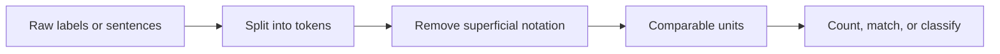

## Jaccard Overlap

**What it does:** Jaccard overlap asks, "Of everything seen in either group, what fraction is seen in both?" It is used in the zebrafish paper to compare proteoform sets between telencephalon and optic tectum.

**Biological analogy:** If one tissue has 100 detected proteins, another has 100, and 20 are shared, Jaccard asks how large that shared core is relative to the full combined list.

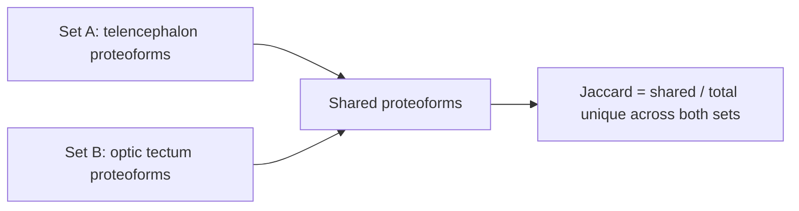

## Weighted Jaccard and Bray-Curtis Similarity

**What it does:** Ordinary Jaccard treats all detected entries as present or absent. Weighted Jaccard and Bray-Curtis also consider abundance or intensity. They ask whether the same molecules dominate the samples, not merely whether the same names appear somewhere.

**Biological analogy:** Two cell types may both express actin and tubulin, but if one is dominated by synaptic proteins and the other by contractile proteins, abundance-aware similarity will show that they are still very different.

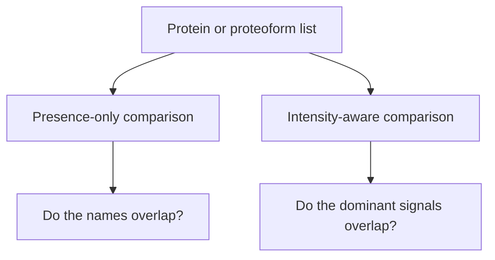

## Wilson Interval

**What it does:** A Wilson interval gives an uncertainty range for a proportion, especially when the count is small or near zero. It is more stable than the simplest textbook interval in sparse biological settings.

**Biological analogy:** If 9 of 10 marker proteins align with the expected tissue, we should not report only 90%. The Wilson interval reminds us that 10 observations are still a small sample.

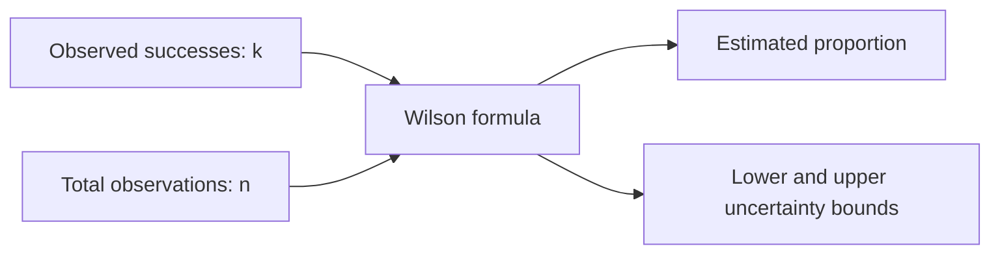

## Odds Ratio

**What it does:** An odds ratio compares how strongly an event is associated with one group versus another. In the zebrafish example, it helps ask whether marker families or acetylated proteoforms are enriched in one region.

**Biological analogy:** If a modification appears much more often in one tissue than another, the odds ratio summarizes the size of that enrichment.

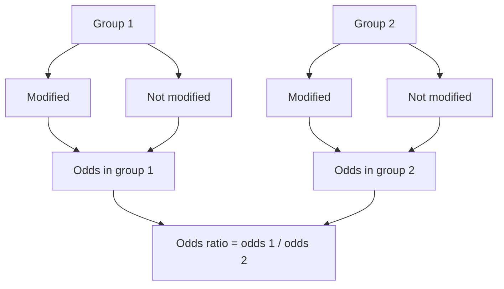

## Fisher Exact and Hypergeometric Tests

**What it does:** These tests ask whether an observed overlap or enrichment is more extreme than expected by chance, given the marginal counts. They are useful when counts are small and approximate tests may be unreliable.

**Biological analogy:** This is the same logic as asking whether a GO term appears unusually often in a gene list, given how many genes could have appeared.

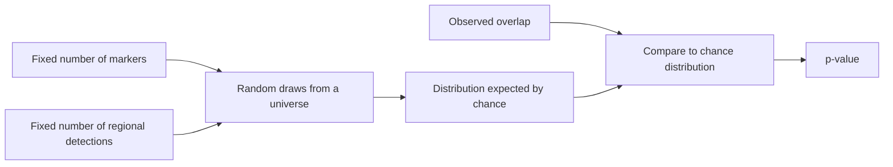

## Logistic Regression

**What it does:** Logistic regression models a yes/no outcome using several predictors. In the zebrafish example, it is used as a sensitivity check for N-terminal acetylation while accounting for precursor mass, sequence span, and first-residue position.

**Biological analogy:** It is like asking whether a phenotype is associated with a genotype after adjusting for age, sex, and batch. The answer is not just "different or not different"; it is "different after accounting for known confounders?"

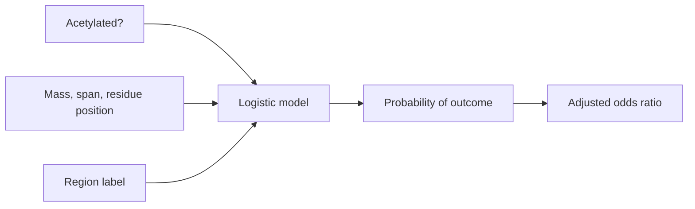

## Bootstrap

**What it does:** The bootstrap repeatedly resamples the observed data and reruns the analysis. The spread of the repeated answers estimates how stable the result is.

**Biological analogy:** Imagine drawing cells from the same sample again and again, with replacement, to ask whether the observed pattern depends on a few unusual cells.

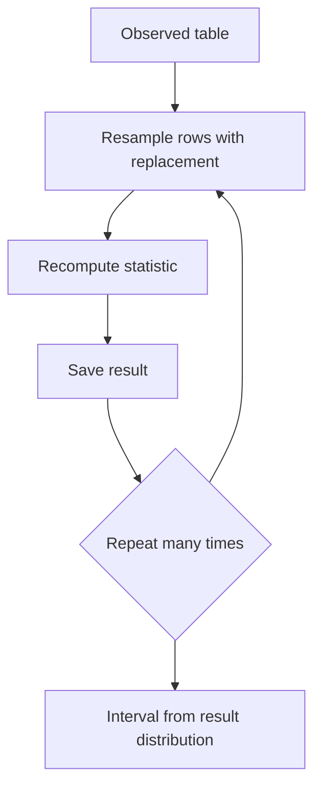

## Permutation Test

**What it does:** A permutation test shuffles labels while preserving the structure of the data. It asks what result would appear if the labels had no biological meaning.

**Biological analogy:** If marker families seem aligned with brain regions, shuffle the region labels many times. If the real alignment is stronger than nearly every shuffled version, the pattern is unlikely to be accidental.

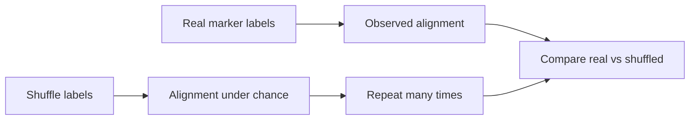

## Chao2 and Jackknife Richness

**What it does:** Chao2 and jackknife estimators use repeat detections to estimate how many unseen items may exist. They are common in ecology and translate naturally to proteomics detection.

**Biological analogy:** If many species appear in only one trap night, more species probably remain unseen. Similarly, if many proteoforms appear in only one technical run, the experiment may have missed additional proteoforms.

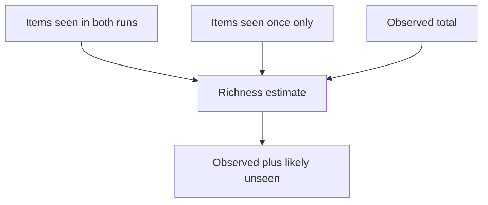

## Occupancy and Detectability Model

**What it does:** An occupancy model separates two ideas: whether a molecule is truly present, and whether the experiment detected it. The zebrafish analysis uses a lightweight two-run version to ask how much hidden overlap could be explained by incomplete detection.

**Biological analogy:** A bird may live in a forest even if it is not heard during one survey. A proteoform may exist in a region even if it is missed in one mass-spectrometry run.

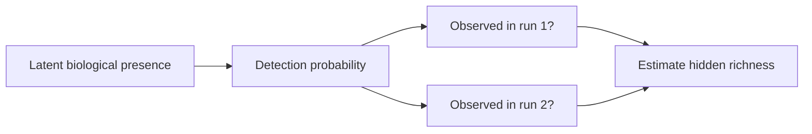

## Missingness Sensitivity and MNAR-Style Fill

**What it does:** Missingness sensitivity asks whether conclusions survive plausible missing data. MNAR means "missing not at random": low-abundance signals, for example, may be more likely to disappear from a table.

**Biological analogy:** A low-copy transcription factor is harder to detect than actin. If the missing entries are mostly weak signals, the analysis should check whether adding small plausible values would change the conclusion.

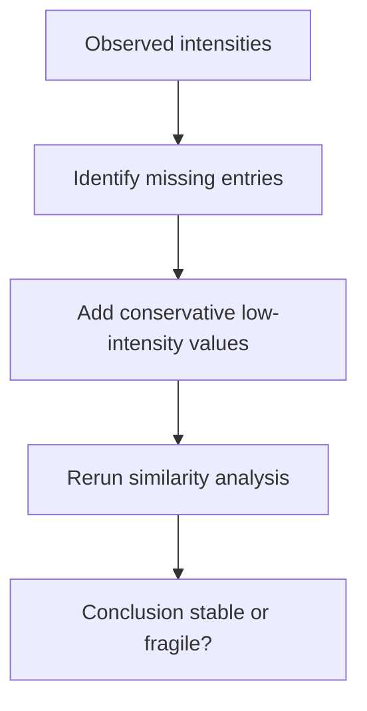

## Normalization

**What it does:** Normalization rescales samples so differences in total signal, instrument loading, or run depth do not dominate the biological comparison. The zebrafish analysis uses total-sum, upper-quartile, and median-ratio style checks.

**Biological analogy:** This is like library-size normalization in RNA-seq. Before comparing gene expression, one must adjust for the fact that one sample may have more total reads.

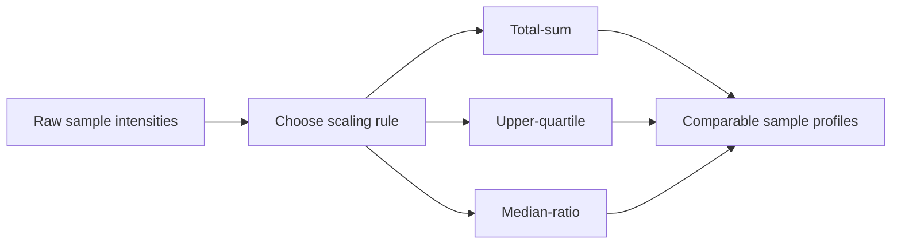

## Lexicon Counting

**What it does:** Lexicon counting uses predefined word lists to measure themes in text. In the Wilkinson-Jefferson humanities paper, words linked to warmth, utility, and defense are counted in excerpts and summaries.

**Biological analogy:** It resembles counting marker genes for broad cell states. The method is simple and interpretable, but it depends on a carefully chosen marker list.

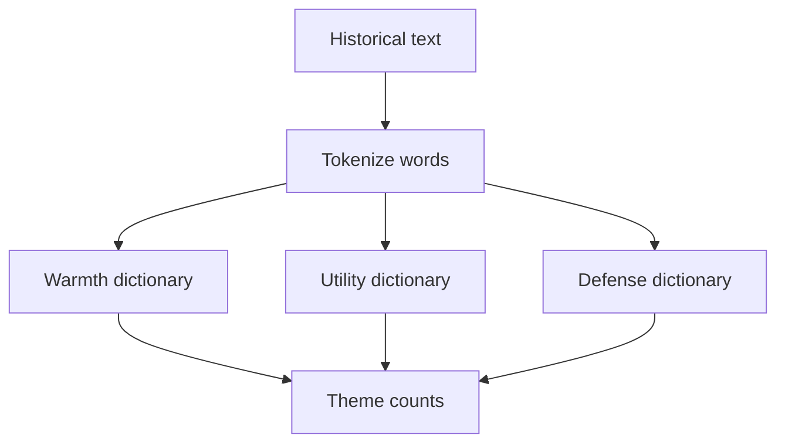

## Co-Occurrence Network

**What it does:** A co-occurrence network records which entities appear together. Nodes are people, places, or concepts; edges connect pairs that co-occur; edge weights count repeated connections.

**Biological analogy:** A protein interaction network connects proteins that interact or co-appear. Here the same graph idea is used for historical documents rather than molecules.

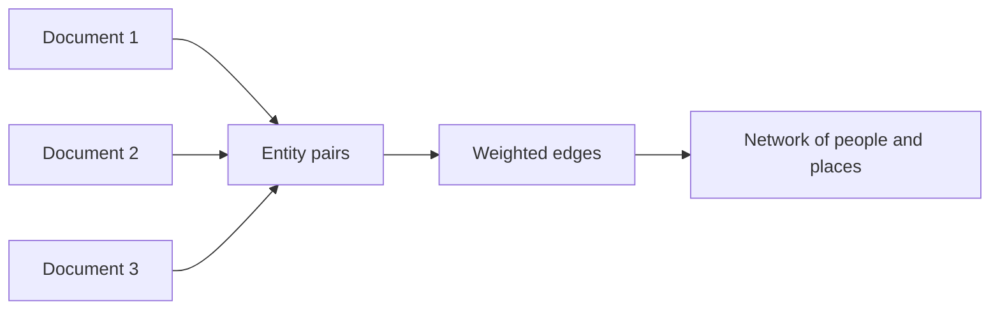

## Leave-One-Out Sensitivity

**What it does:** Leave-one-out sensitivity repeats an analysis after removing one observation, document, marker family, or record at a time. It asks whether the conclusion depends on a single item.

**Biological analogy:** If removing one animal reverses the result, the finding is fragile. If the conclusion holds after each animal is removed in turn, it is more stable.

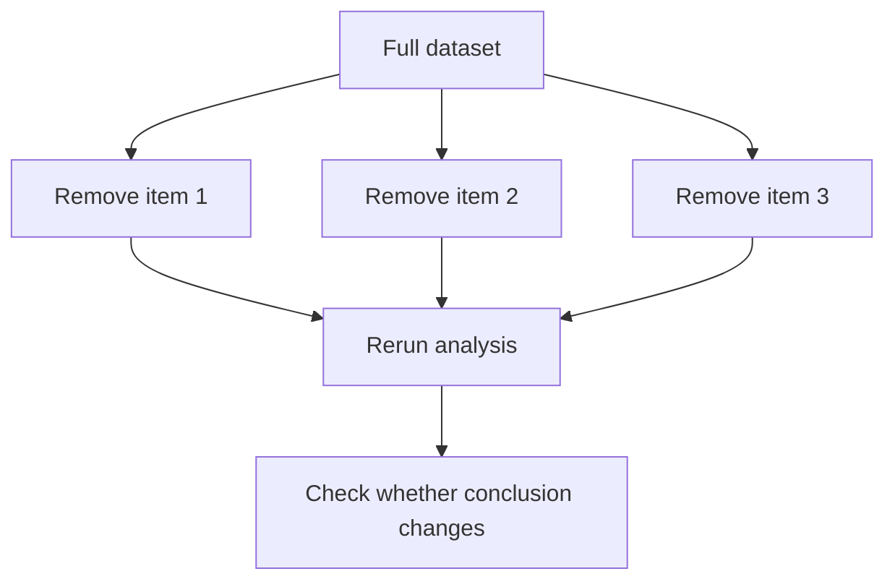

## Monte Carlo Simulation

**What it does:** Monte Carlo simulation runs many randomized versions of a system to estimate average behavior and variability. The full-paper sample uses stochastic episodes to compare control policies for a battery-constrained robot.

**Biological analogy:** It is like simulating many virtual animals, each with slightly different noise, stress, and environment, to see which treatment would perform best on average.

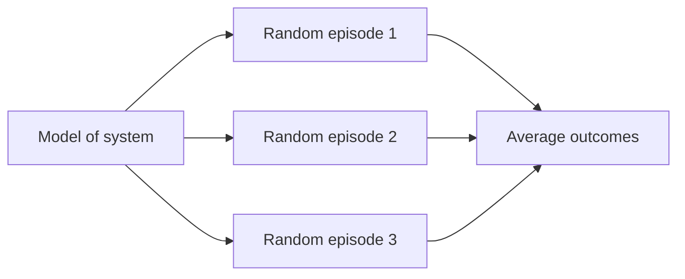

## Grid Search

**What it does:** Grid search tries a list of possible parameter values and keeps the one with the best objective. In the robotics sample, it tunes the threshold `tau` for a battery-gated policy.

**Biological analogy:** It is like testing several drug doses in a pilot assay and choosing the dose with the best efficacy-to-toxicity balance.

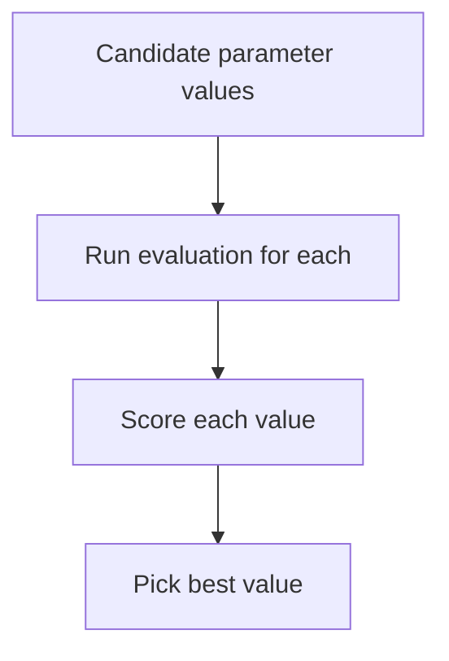

## Sigmoid or Logistic Curve

**What it does:** A sigmoid turns a continuous score into a probability-like value between 0 and 1. Logistic regression uses it, and the simulation uses a similar curve to turn instability into fall probability.

**Biological analogy:** Many biological responses are threshold-like but smooth: below a dose little happens, then response rises sharply, then it saturates. A sigmoid captures that shape.

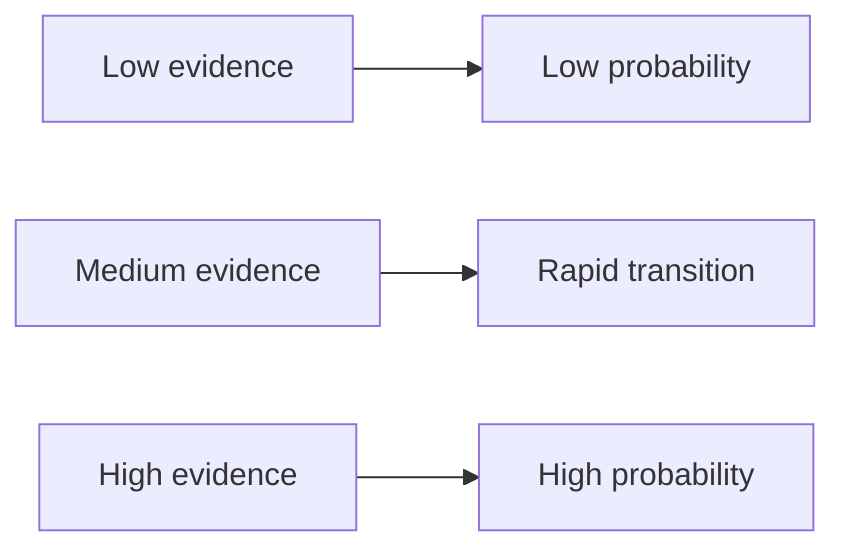

## Heuristic Policy

**What it does:** A heuristic policy is a transparent rule for choosing an action. The robotics sample compares static, periodic, always-on, threshold, and battery-gated adaptation policies.

**Biological analogy:** A heuristic is like a triage rule: treat if fever exceeds a threshold, monitor otherwise. It is not learned from massive data, but it is interpretable and testable.

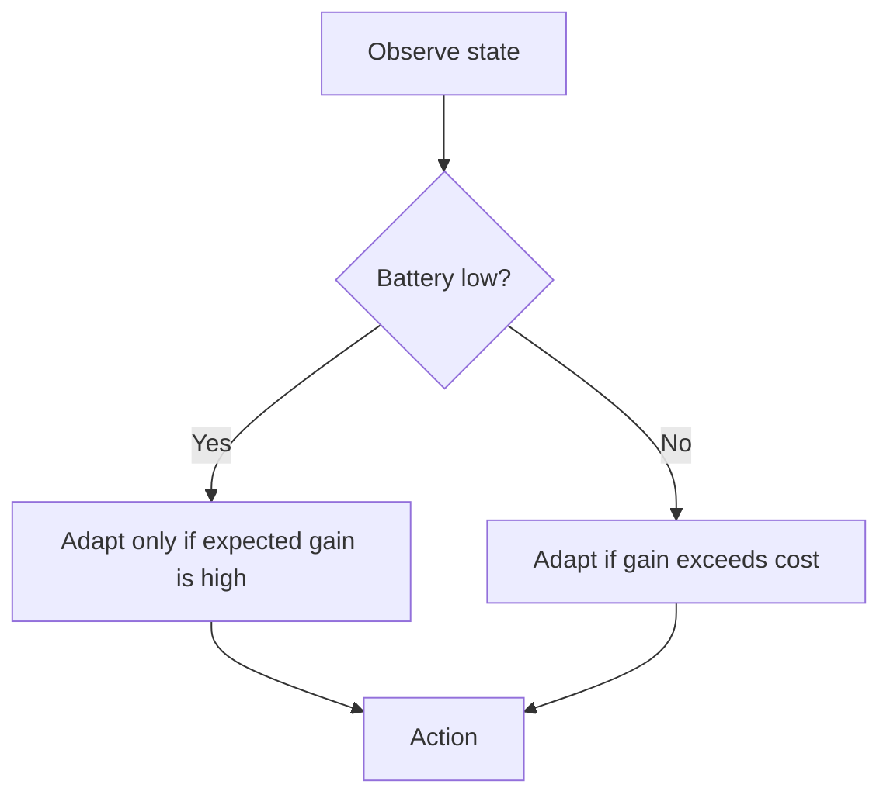

## Queue Scheduler and State Machine

**What it does:** The experiment queue scheduler launches jobs onto free GPUs, tracks pending/running/completed/stuck states, detects out-of-memory failures, and retries bounded failures.

**Biological analogy:** This is like assigning instruments in a core facility. Samples wait in a queue, machines become available, failed runs may be repeated, and completed outputs are recorded.

```mermaid
stateDiagram-v2
    [*] --> Pending
    Pending --> Running: GPU free
    Running --> Completed: expected output found
    Running --> FailedOOM: CUDA out of memory
    FailedOOM --> Pending: retry allowed
    FailedOOM --> Stuck: retry limit reached
    Running --> Stuck: process ended without output
```

## Review-Revision Loop

**What it does:** The paper-improvement workflow treats review as an algorithm: submit or generate critique, extract weaknesses, revise the paper, rebuild artifacts, and review again. The repo requires a revision after a review because feedback has value only if it changes the manuscript.

**Biological analogy:** This resembles iterative experimental optimization: run assay, inspect failure modes, change protocol, rerun. The loop is deliberate, recorded, and judged by improved evidence and writing.

```mermaid
flowchart LR
    A["Draft paper"] --> B["Fresh review"]
    B --> C["Specific criticisms"]
    C --> D["Revision"]
    D --> E["Rebuild paper and audits"]
    E --> F{"Ready?"}
    F -->|No| B
    F -->|Yes| G["Submission package"]
```

## External AI Reviewer

**What it does:** The repository can submit a paper to `paperreview.ai` and save the returned token, review text, scorecard, and revision artifacts. The service model itself is external and not specified in this repository, so the honest description is "black-box AI review service" rather than a named algorithm.

**Biological analogy:** Treat it like sending a manuscript to an outside core or statistical reviewer. The returned critique can be useful evidence for revision, but the internal assay conditions are not fully visible to us.

```mermaid
flowchart LR
    A["Paper PDF"] --> B["External review service"]
    B --> C["Token"]
    B --> D["Review text"]
    B --> E["Scorecard when available"]
    D --> F["Local revision loop"]
    E --> F
```

## Transformer

**What it does:** A Transformer is a neural-network architecture that lets each token in a sequence look at other tokens through attention. It is the foundation for modern language models used by Codex, GPT-style models, and many BERT-style models.

**Biological analogy:** Attention is like letting every residue in a protein sequence consult every other residue before deciding its role in the folded structure. Long-range context matters.

```mermaid
flowchart TD
    A["Input tokens"] --> B["Token embeddings"]
    B --> C["Attention: which other tokens matter?"]
    C --> D["Feed-forward processing"]
    D --> E["Context-aware representations"]
```

## Embedding Methods in Model Pretraining

**What it does:** An embedding turns a discrete object, such as a word fragment, amino acid, image patch, gene, or sample, into a vector of numbers that a model can learn from. In original model training, these vectors are usually learned together with the model's main task. For GPT-style models the task is next-token prediction. For BERT-style models it is often masked-token recovery. For image models it may be object classification, patch reconstruction, or contrastive matching. For protein language models it is often amino-acid or protein-token prediction.

**Important boundary:** This repository uses Codex/OpenCode and external review systems, but it does not expose the exact proprietary embedding tables or training data of those backend models. The descriptions below explain the standard embedding mechanisms used by the model families discussed in the project, not private implementation details.

**Biological analogy:** An embedding is like placing genes on a functional map. Genes with related roles, expression patterns, or sequence contexts tend to land near each other. The map is learned from data rather than drawn by hand.

| Embedding method | Where it appears in original training | What the model learns |
| --- | --- | --- |
| Token embedding | GPT, BERT, and most text Transformers | A vector for each token or word piece |
| Positional embedding | GPT, BERT, and most Transformers | Where each token sits in the sequence |
| Segment embedding | BERT-style sentence-pair training | Which sentence or text segment a token belongs to |
| Contextual embedding | Transformer hidden layers | How token meaning changes with surrounding context |
| Protein sequence embedding | Protein language models | Residue, motif, and long-range sequence context |
| Patch embedding | Vision Transformers | A vector for each image patch |
| CNN feature map | CNN image training | Local visual motifs such as edges, puncta, nuclei, or tissue texture |
| Category embedding | Deep tabular models | A vector for categorical fields such as tissue, cell type, or platform |
| Document embedding | Retrieval and semantic-search models | A compact vector for an abstract, paragraph, paper, or note |

```mermaid
flowchart LR
    A["Raw object: token, residue, patch, gene, or sample"] --> B["Lookup or encoder"]
    B --> C["Vector embedding"]
    C --> D["Model training task"]
    D --> E["Embeddings improve with training"]
```

### Token Embeddings

Text models first split text into tokens, often word pieces rather than whole words. Each token receives a learned vector. During training, tokens that appear in similar contexts develop related vectors.

```mermaid
flowchart LR
    A["adult zebrafish telencephalon"] --> B["adult | zebra | fish | telencephalon"]
    B --> C["Vector for each token"]
    C --> D["Contextual model"]
```

### Positional Embeddings

A Transformer needs information about order. Positional embeddings tell the model whether a token is early, late, nearby, or far away in the sequence. Without position, "protein binds ligand" and "ligand binds protein" would look too similar.

```mermaid
flowchart TD
    A["Token identity"] --> C["Combined input vector"]
    B["Position in sequence"] --> C
    C --> D["Transformer attention layers"]
```

### Segment or Sentence Embeddings

BERT-style models may add segment embeddings to distinguish sentence A from sentence B. This helps tasks such as question answering, sentence-pair classification, and literature search.

```mermaid
flowchart LR
    A["Sentence A tokens"] --> C["Token + position + segment vectors"]
    B["Sentence B tokens"] --> C
    C --> D["Bidirectional text representation"]
```

### Contextual Embeddings

Older embeddings such as word2vec gave one vector per word. Modern Transformers produce contextual embeddings: the vector for "cell" differs in "cell culture", "prison cell", and "single-cell RNA-seq".

```mermaid
flowchart TD
    A["Same token: cell"] --> B["Context: culture medium"]
    A --> C["Context: single-cell atlas"]
    B --> D["Embedding tuned to laboratory context"]
    C --> E["Embedding tuned to omics context"]
```

### Protein and Biological Sequence Embeddings

Protein language models treat amino acids or sequence fragments like tokens. During training, the model learns that certain residues, motifs, and long-range sequence contexts tend to imply structure or function. These embeddings can later help with protein annotation, variant interpretation, or structure-aware search.

```mermaid
flowchart LR
    A["Amino-acid sequence"] --> B["Residue or k-mer tokens"]
    B --> C["Protein sequence embeddings"]
    C --> D["Function, structure, or variant model"]
```

### Image and Patch Embeddings

CNNs do not usually begin with a token lookup table. They learn small filters directly from pixels. Vision Transformers, by contrast, often divide an image into patches and embed each patch like a token. Both approaches turn raw images into feature vectors that later layers can use.

```mermaid
flowchart TD
    A["Microscopy or tissue image"] --> B["CNN filters"]
    A --> C["Image patches"]
    C --> D["Patch embeddings"]
    B --> E["Spatial feature maps"]
    D --> F["Transformer image tokens"]
```

### Tabular Feature Embeddings

Logistic regression and XGBoost usually start from explicit columns: intensity, age, batch, gene count, treatment group, and so on. If a column is categorical, it may be one-hot encoded or embedded. In deep tabular models, learned embeddings can represent categories such as tissue, cell type, perturbation, or assay platform.

```mermaid
flowchart LR
    A["Tabular biology data"] --> B["Numeric features"]
    A --> C["Categorical features"]
    C --> D["One-hot or learned category vectors"]
    B --> E["Model input"]
    D --> E
```

### Sentence, Document, and Literature Embeddings

For search and retrieval, a whole sentence, abstract, or paper can be compressed into one vector. Nearby vectors should mean related scientific content. This is the idea behind semantic search over papers, methods, and notes.

```mermaid
flowchart LR
    A["Abstract or paragraph"] --> B["Language model encoder"]
    B --> C["Single document vector"]
    C --> D["Find nearby papers or notes"]
```

## GPT-Style Language Model

**What it does:** A GPT-style model is a Transformer trained to predict the next token. By repeating next-token prediction, it writes, summarizes, reasons, critiques, and drafts code. Codex-style workflows rely on this family of model behavior.

**Biological analogy:** It is like inferring the next nucleotide or amino acid from everything upstream, except the learned patterns include grammar, code, scientific prose, and reasoning traces.

```mermaid
flowchart LR
    A["Prompt and prior tokens"] --> B["Transformer context"]
    B --> C["Next-token probabilities"]
    C --> D["Choose next token"]
    D --> E["Append token and repeat"]
```

## BERT-Style Language Model

**What it does:** BERT-style models read text in both directions and learn representations of meaning. They are often used for classification, search, retrieval, and extracting information from literature. This repo does not train BERT directly, but ARIS-style projects may use BERT-like embeddings or literature classifiers.

**Biological analogy:** Unlike reading only left to right, BERT reads the whole sentence around a missing word. It is like interpreting a mutation using both upstream and downstream sequence context.

```mermaid
flowchart TD
    A["Full sentence or abstract"] --> B["Bidirectional Transformer"]
    B --> C["Context embedding"]
    C --> D["Classify, search, or retrieve"]
```

## Convolutional Neural Network

**What it does:** A CNN learns local patterns by sliding small filters across an image, signal, or grid. It is common in microscopy, histology, radiology, gels, and other spatial biological data. This repo does not currently train a CNN in the shipped examples, but the workflow can support projects that do.

**Biological analogy:** A CNN first learns small motifs, such as edges or puncta, then combines them into larger structures, such as nuclei, tissue regions, or colonies.

```mermaid
flowchart LR
    A["Image"] --> B["Small learned filters"]
    B --> C["Local features"]
    C --> D["Larger patterns"]
    D --> E["Prediction or segmentation"]
```

## XGBoost

**What it does:** XGBoost builds many small decision trees in sequence. Each new tree focuses on correcting errors left by the previous trees. It is powerful for structured tables with features such as expression levels, clinical variables, assay metrics, or molecular descriptors.

**Biological analogy:** It is like a diagnostic panel that starts with one rough rule, then adds many small corrective rules until the combined panel separates cases from controls well.

```mermaid
flowchart TD
    A["Tabular features"] --> B["Tree 1: rough prediction"]
    B --> C["Tree 2: correct remaining errors"]
    C --> D["Tree 3: correct remaining errors"]
    D --> E["Sum of many trees"]
    E --> F["Final prediction"]
```

## Random Forest

**What it does:** A random forest trains many decision trees on slightly different samples and feature subsets, then averages their votes. It is robust and interpretable enough for many biological classification tasks.

**Biological analogy:** It is like asking many partially independent pathologists to classify a slide, then taking the majority vote.

```mermaid
flowchart LR
    A["Dataset"] --> B["Tree A"]
    A --> C["Tree B"]
    A --> D["Tree C"]
    B --> E["Votes"]
    C --> E
    D --> E
    E --> F["Consensus prediction"]
```

## Support Vector Machine

**What it does:** An SVM finds a boundary that separates groups while leaving the widest possible margin between them. With kernels, it can separate groups that are not linearly separable in the original feature space.

**Biological analogy:** Imagine drawing the cleanest possible line between responder and non-responder patients, while keeping the line as far as possible from the nearest patients on both sides.

```mermaid
flowchart TD
    A["Samples with features"] --> B["Find separating boundary"]
    B --> C["Maximize margin"]
    C --> D["Classify new sample by side of boundary"]
```

## PCA, UMAP, and t-SNE

**What they do:** These methods reduce many measured variables into two or three visual axes. PCA preserves broad linear variation; UMAP and t-SNE emphasize neighborhood structure. They are common in single-cell, proteomics, and imaging projects. They are background methods for ARIS users rather than central algorithms in the current shipped examples.

**Biological analogy:** They are maps. A map is not the territory, but it helps reveal whether samples cluster by cell type, tissue, treatment, or batch.

```mermaid
flowchart LR
    A["Thousands of features"] --> B["Dimensionality reduction"]
    B --> C["Two-dimensional map"]
    C --> D["Look for tissue, cell-type, or batch structure"]
```

## Linear Regression

**What it does:** Linear regression relates a continuous outcome to one or more predictors. It is the simplest model for asking how much a measurement changes with a variable. The current examples lean more on logistic regression and descriptive statistics, but linear regression is a standard model family that ARIS workflows may use in generated projects.

**Biological analogy:** If enzyme activity rises with drug dose over a limited range, linear regression estimates the slope of that rise.

```mermaid
flowchart LR
    A["Predictor: dose or expression"] --> B["Straight-line model"]
    B --> C["Outcome: activity or phenotype"]
    C --> D["Slope and uncertainty"]
```

## How to Choose Among These Methods

| Biological question | Natural method family |
| --- | --- |
| Do two tissues share the same detected molecules? | Jaccard, weighted Jaccard, Bray-Curtis |
| Is a feature enriched in one group? | Odds ratio, Fisher exact test, logistic regression |
| Could missing detections change the conclusion? | Occupancy model, Chao2, jackknife, MNAR sensitivity |
| Is a pattern stable to sampling noise? | Bootstrap, permutation, leave-one-out |
| Is a text corpus organized around certain themes? | Tokenization, lexicon counting, co-occurrence network |
| Which policy performs best under noisy conditions? | Monte Carlo simulation, grid search, heuristic policy comparison |
| How does a model turn raw biology or text into vectors? | Token, position, patch, protein-sequence, and document embeddings |
| Which model predicts from tabular assay data? | Logistic regression, random forest, XGBoost, SVM |
| Which model interprets image-like biological data? | CNN, Vision Transformer, segmentation models |
| Which model reads or writes scientific text? | Transformer, GPT-style model, BERT-style model |

## Practical Reading Rule

When reading an ARIS-generated paper or example, ask four questions:

1. **What is the unit of comparison?** A proteoform, gene, document, token, patient, image, or episode?
2. **What is the algorithm trying to estimate?** Similarity, enrichment, prediction, uncertainty, hidden missingness, or a decision rule?
3. **What assumptions could break it?** Batch effects, missing data, small sample size, label leakage, confounding, or a poor dictionary?
4. **Did the project stress-test the claim?** Look for bootstrap, permutation, leave-one-out, normalization checks, detectability checks, and fresh review-driven revision.

Good computation is not a decorative layer on top of biology. It is a way of making a biological claim precise enough that it can be challenged, repeated, and improved.
